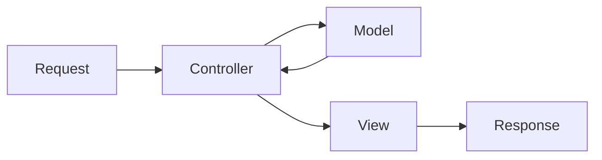
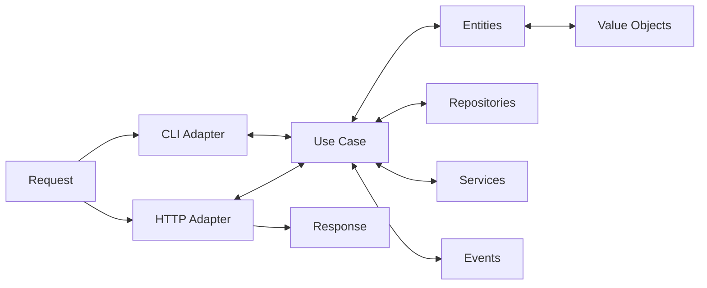

# Propuesta de aplicación de comercio electrónico

Cordial saludo.

Mi nombre es Alejandro Carrasco, soy Analísta y Desarrollador de Sistemas de Información, y en este documento presentaré mi propuesta de aplicación de comercio electrónico.

<br>

## Calidad y eficacia

El primer eslabón que debemos tener en cuenta es el sistema de calidad que guiará el proyecto. En primera instancia usaré el [standard de análisis de requerimientos de mi autoría](https://github.com/virtualitems/documentation/) que facilita el correcto entendimiento de los requerimientos del cliente para todo el equipo de trabajo en sus diferentes roles.

En segunda instancia, usaremos metodologías de desarrollo ágil, en este caso, [Scrum](https://www.scrum.org/), que nos permitirá entregar valor al cliente en ciclos cortos de tiempo, y adaptarnos a los cambios que se presenten en el camino.

<br>

## Infraestructura

Para el desarrollo de la aplicación, se requiere una infraestructura escalable, resiliente y segura. Para ello, se propone el uso de [Amazon Web Services](https://aws.amazon.com/es/), que nos permite tener un control total sobre la infraestructura, y nos permite escalarla facilmente de acuerdo a las necesidades del negocio.

<br>

## Arquitectura de componentes de software

La arquitectura de los componentes de la aplicación se basan tanto en el patrón de arquitectura MVC (Model, View, Controller), como en el patrón de arquitectura Hexagonal. Adicionalmente todo desarrollo será analizado y diseñado de acuerdo a patrones de diseño, principios SOLID, y buenas prácticas de software.

<br>

### MVC

El patrón MVC nos permite un rápido desarrollo de componentes sencillos que pueden desacoplarse de la aplicación principal. Por ejemplo: las páginas web, el servidor oauth o servicios de contenido estático.

<br>

#### Estructura de directorios

```yml
OAuthServer:

    - controllers:
        Authentication

    - models:
        User

    - views:
        Login
```

<br>

#### Flujo de ejecución



<br>

### Hexagonal

El patrón Hexagonal nos permite separar la lógica de negocio de la lógica de presentación, y así tener un código limpio, fácil de extender y fácil de mantener.

<br>

#### Estructura de directorios

```yml
Payments:

    - adapters:
        - driven: # Servicios que uso
            - Repositories
            - APIs
            - Messaging

        - driving: # Servicios que me usan
            - Http
            - Cli
            - Events

    - use_cases: # Lógica de negocio
        - Repositories
        - Services
        - Events
        - Commands
        - Queries
        - Error Handlers

    - domain: # Modelo del dominio
        - entities
        - value_objects
```

<br>

#### Flujo de ejecución



<br>

## Tecnologías

Para el desarrollo de la aplicación, se propone el uso de las siguientes tecnologías:

### Control de versiones

- [Git](https://git-scm.com/).

- [Gitlab](https://about.gitlab.com/) Nos permite tener propiedad sobre el servidor de control de versiones y tiene infraestructura CI/CD integrada.

### Lenguajes de programación

- [Python 3](https://www.python.org/) Debido a su fácil manejo, legibilidad, manejo de grandes volúmenes de datos, y  su capacidad de extenderlo con módulos escritos en C, C++.

- [JavaScript](https://developer.mozilla.org/es/docs/Web/JavaScript) Debido a su soporte nativo de asincronismo y su gran versatilidad pudiendo ejecutarse en el servidor y en los navegadores web.

### Testing

- [unittest](https://docs.python.org/3/library/unittest.html) Para pruebas unitarias del lado del servidor.

- [jest](https://jestjs.io/) Para pruebas unitarias del lado del navegador web.

### Frameworks

- [Django](https://www.djangoproject.com/) Para aplicaciones de arquitectura MVC.

- [FastAPI](https://fastapi.tiangolo.com/) Para aplicaciones de arquitectura Hexagonal.

- [NodeJS](https://nodejs.org/es/) Para componentes con funcionalidades de tiempo real.

- [ReactJS](https://es.reactjs.org/) Para crear la interfaz gráfica de usuario ya que su base de código puede ser compartida con la aplicación móvil usando [React Native](https://reactnative.dev/), lo que nos permite reducir costos de desarrollo.

### Bases de datos

- [Amazon RDS con Postgresql](https://aws.amazon.com/es/rds/postgresql/) Para almacenar datos estructurados por la gran cantidad de features de postgresql y el gran soporte de su comunidad.

- [MongoDB Atlas](https://aws.amazon.com/es/solutions/partners/mongodb-atlas/) Para almacenar datos no estructurados por su gran velocidad al realizar consultas.

### Servicios de AWS

- [Amazon Route 53](https://aws.amazon.com/es/route53/) Para administrar los dominios.

- [Amazon API Gateway](https://aws.amazon.com/es/api-gateway/) Para administrar las APIs.

- [Amazon EC2](https://aws.amazon.com/es/ec2/) Para alojar los componentes de la aplicación.

- [Amazon S3](https://aws.amazon.com/es/s3/) Para almacenar archivos estáticos como imágenes, videos, documentos, etc.

- [Amazon SQS](https://aws.amazon.com/es/sqs/) Para enviar mensajes entre componentes.

- [Amazon SES](https://aws.amazon.com/es/ses/) Para enviar correos electrónicos.
